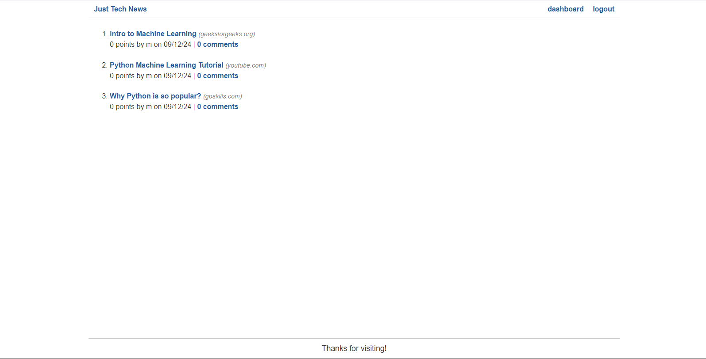
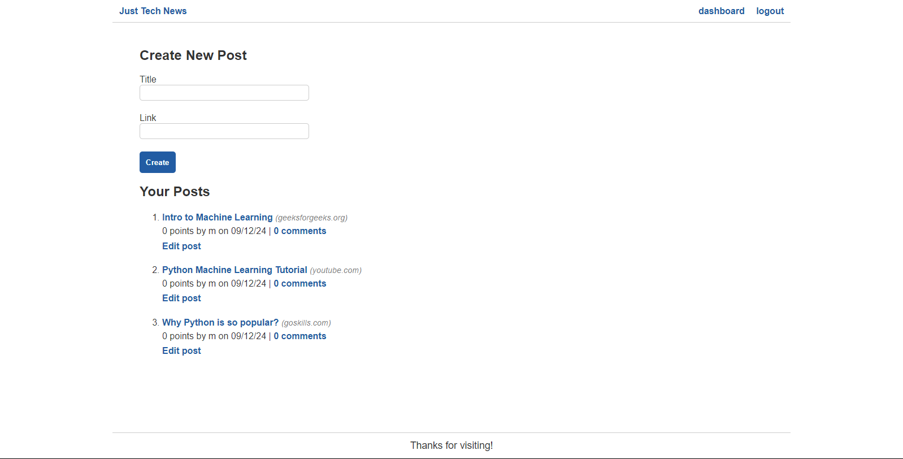
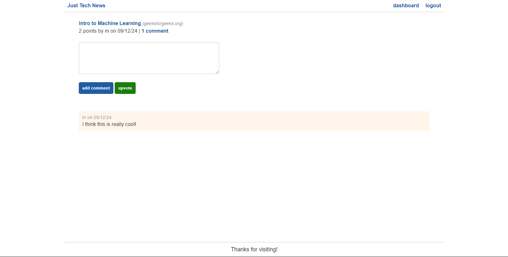
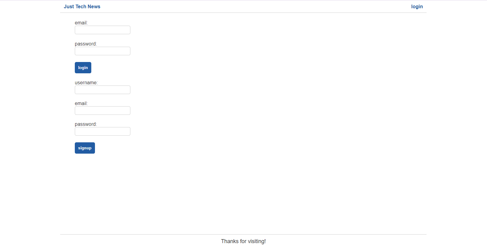

# python-newsfeed

  

## Description
A continuation assignment from Vanderbilt University's bootcamp where the assignemnt was to learn how to implmenet the backend of a tech news site with Python. The site had starter code for the frontend built with Node.js. The site involves signing up and users can create posts, edit posts, delete posts, comment, and upvote any post. My task was to create the models, routes, seeds file, and util folder.

## Table of Content
-[Description](#Description)
-[Process](#Process)
-[Links](#Links)
-[Installation](#Installation)
-[Usage](#Usage)
-[Licenses](#Licenses)
-[Contribution](#Contribution)
-[Test](#Test)
-[Acknowledgement](#Acknowledgement)
-[Questions](#Questions)

## Process
The process included creating the virtual environment where dependencies are installed and where the development process occurs. I installed Flask for the background framework that is used similar to Express.js. App/_init_.py includes the function to create the app itself by setting the paths, secret key, and registering the routes and custom filters. The database is stored in the MySQL database platform. The db/_init.py initiates the database, connects to session, and closes the session. An important global variable known as g holds the current session so second sessions are not created in one instance. Four models were created for the site: User, Post, Comment and Vote. Several routes were completed for the app including to home routes: signup, login, loguout, and dashboard routes: get posts, edit posts. Users created were made in data sections known as dictionaries that resemble objects in JS. Try, except blocks were used like try, catch blocks. Of course, the app cannot be completed with the user authentication decorator for certain routes to be accessed. The completion of this assignment concluded with deployment to Heroku.

## Links
Link to site: https://py-ex-tech-news-784b646bd364.herokuapp.com/

## Installation
To install this application, copy the ssh key from my github repo and clone it into your respository. Do an npm install. Run python seeds.py to seed the data. Deploy to Heroku to access site.

## Usage
This site was a practice assignment for bootcamp students but can be used to see how an application made by Python works. 

## Licenses
This repository is using the [MIT](https://opensource.org/licenses/MIT) license.

## Contribution
Contact me by email provided in Questions section.

## Test
To test this application, simply open the applcation in VScode to try it out.

## Acknowledgement
Project was done by the knowledge learned from Vanderbilt coding bootcamp.

## Questions
Contact with questions at:

Email: mackenzielmoore14@gmail.com
Click [here](https://github.com/mackemo) for Github account.